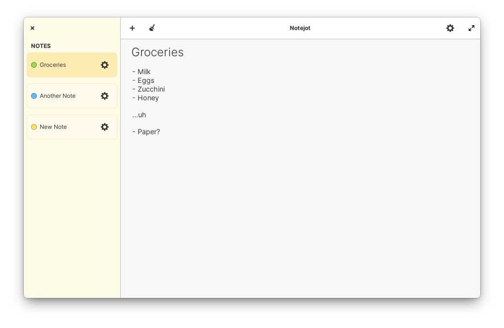

#  Notejot
###### Stupidly simple jotting pad.



## Dependencies

Please make sure you have these dependencies first before building.

```
granite
gtk+-3.0
gtksourceview-3.0
```

## Building

Simply clone this repo, then:

```
$ mkdir build && cd build
$ cmake -DCMAKE_INSTALL_PREFIX=/usr ../
$ sudo make install
```