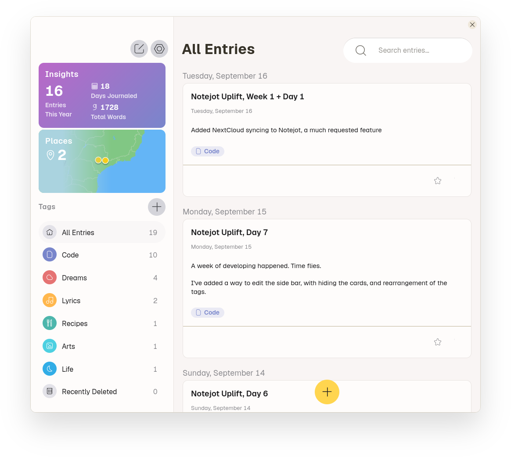

#  Notejot

## Stupidly simple notes app

<a href='https://flathub.org/apps/details/io.github.lainsce.Notejot'></a>

[](https://stopthemingmy.app)
[](http://www.gnu.org/licenses/gpl-3.0)



## Donations 

Would you like to support the development of this app to new heights? Then:

[Be my backer on Patreon](https://www.patreon.com/lainsce)

## Dependencies

Please make sure you have these dependencies first before building.

```bash
gtk4
libjson-glib
libgee-0.8
libadwaita-1
meson
vala
```

## Building

Simply clone this repo, then:

```bash
meson build --prefix=/usr && cd build
sudo ninja install
```

## Notes Storage
Notes are stored in `~/.var/app/io.github.lainsce.Notejot/`
